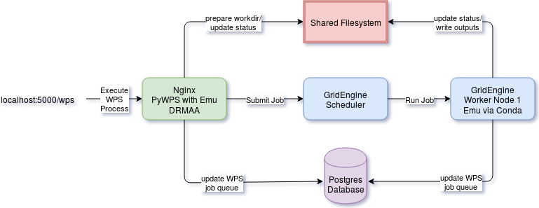

.. _pywps-gridengine-demo:

************************************
PyWPS Demo with GridEngine scheduler
************************************

This is a demo to show how a `PyWPS`_ service can use a GridEngine scheduler for job delegation.
The WPS service uses the `DRMAA`_ Python library to start a GridEngine batch job on the
GridEngine server.

.. _`PyWPS`: http://pywps.org/
.. _`DRMAA`: http://drmaa-python.readthedocs.io/en/latest/index.html

Architecture
*************

The architecture consists of the PyWPS service (including Nginx), the GridEngine scheduler,
1 or more GridEngine worker nodes, a Postgres database and a shared filesystem
(used for PyWPS status documents, workdir and outputs).

How to run the demo
*******************

Prepare the demo
-----------------

First get this demo from github::

  $ git clone https://github.com/bird-house/birdhouse-docker-images.git

Change in to the docker ``pywps-gridengine-demo`` directory::

  $ cd birdhouse-docker-images/pywps-gridengine-demo

Get docker images using docker-compose::

  $ docker-compose pull

Run the demo with docker
------------------------

Start the demo with docker-compose::

  $ docker-compose up -d  # runs with -d in the background
  $ docker-compose logs -f  # check the logs if running in background

By default the WPS service should be available on port 5000::

  $ firefox "http://localhost:5000/wps?service=wps&request=GetCapabilities"

Run a "hello" to see if the service is responding::

  $ firefox "http://localhost:5000/wps?service=wps&request=Execute&version=1.0.0&identifier=hello&datainputs=name=Friday"

This process was run synchronously and was executed on the WPS server itself.

Now, we run a "sleep" process in async mode which will be delegated to the GridEngine server::

  $ firefox "http://localhost:5000/wps?service=wps&request=Execute&version=1.0.0&identifier=sleep&datainputs=delay=10&storeExecuteResponse=true&status=true"

Hopefully you will get a status response looking like this:

.. code-block:: xml

  <!-- PyWPS 4.0.0 -->
  <wps:ExecuteResponse xmlns:gml="http://www.opengis.net/gml"
    xmlns:ows="http://www.opengis.net/ows/1.1"
    xmlns:wps="http://www.opengis.net/wps/1.0.0"
    xmlns:xlink="http://www.w3.org/1999/xlink"
    xmlns:xsi="http://www.w3.org/2001/XMLSchema-instance"
    xsi:schemaLocation="http://www.opengis.net/wps/1.0.0 http://schemas.opengis.net/wps/1.0.0/wpsExecute_response.xsd"
    service="WPS" version="1.0.0" xml:lang="en-US"
    serviceInstance="http://localhost:5000/wps?service=WPS&amp;request=GetCapabilities"
    statusLocation="http://localhost:5001/wpsoutputs/emu/ae284b7e-3708-11e7-8c84-0242ac110003.xml">
  <wps:Process wps:processVersion="1.0">
    <ows:Identifier>sleep</ows:Identifier>
    <ows:Title>Sleep Process</ows:Title>
    <ows:Abstract>Testing a long running process, in the sleep.This process will sleep for a given delay or 10 seconds if not a valid value.</ows:Abstract>
  </wps:Process>
  <wps:Status creationTime="2017-05-12T11:46:48Z">
    <wps:ProcessAccepted>PyWPS Process sleep accepted</wps:ProcessAccepted>
  </wps:Status>
  </wps:ExecuteResponse>

Poll the status location link given in this document, for example::

  $ firefox "http://localhost:5001/wpsoutputs/emu/ae284b7e-3708-11e7-8c84-0242ac110003.xml"

You might get the following response:

.. code-block:: xml

  <wps:ExecuteResponse xmlns:gml="http://www.opengis.net/gml"
    xmlns:ows="http://www.opengis.net/ows/1.1"
    xmlns:wps="http://www.opengis.net/wps/1.0.0"
    xmlns:xlink="http://www.w3.org/1999/xlink"
    xmlns:xsi="http://www.w3.org/2001/XMLSchema-instance"
    xsi:schemaLocation="http://www.opengis.net/wps/1.0.0 http://schemas.opengis.net/wps/1.0.0/wpsExecute_response.xsd"
    service="WPS" version="1.0.0" xml:lang="en-US"
    serviceInstance="http://localhost:5000/wps?service=WPS&amp;request=GetCapabilities"
    statusLocation="http://localhost:5001/wpsoutputs/emu/cc6410fe-3709-11e7-8c84-0242ac110003.xml">
    <wps:Process wps:processVersion="1.0">
      <ows:Identifier>sleep</ows:Identifier>
      <ows:Title>Sleep Process</ows:Title>
      <ows:Abstract>Testing a long running process, in the sleep.This process will sleep for a given delay or 10 seconds if not a valid value.</ows:Abstract>
    </wps:Process>
    <wps:Status creationTime="2017-05-12T12:54:58Z">
      <wps:ProcessStarted percentCompleted="20">PyWPS Process started. Waiting...</wps:ProcessStarted>
    </wps:Status>
  </wps:ExecuteResponse>

Poll this status document until the process is completed (hopefully successfully).

Use birdy wps client
--------------------

To have some more convenience you can use the birdy WPS commandline client.

Install it via the conda package manager::

  $ conda install -c birdhouse -c conda-forge birdhouse-birdy

Configure the WPS service::

  $ export WPS_SERVICE=http://localhost:5000/wps

Now, run the birdy on some example processes::

  $ birdy -h
  $ birdy hello -h
  $ birdy hello --name Birdy
  $ birdy sleep --delay 5

Finally ... shutdown
---------------------

Use docker-compose to stop the containers::

  $ docker-compose down --volumes

Advanced steps
**************

Mount shared filesystem
-----------------------

To see what is happening on wps/gridengine processing you currently need to mount the
shared filesystem. You can mount the named volumes::

  $ docker run -it --rm \
    -v pywpsgridenginedemo_log:/shared/log \
    -v pywpsgridenginedemo_lib:/shared/lib \
    debian tail -f /shared/log/supervisor/emu.log

When you start the docker containers as described above you can watch the logs::

  $ tail -f /shared/var/log/pywps/emu.log
  $ tail -f /shared/var/log/supervisor/emu.log

And also the output and working directories (temp folders)::

  $ ls /shared/var/lib/pywps/outputs/emu/
  $ ls /shared/var/lib/pywps/tmp/emu/

How to build the demo image
***************************

Build from this directory using the enclosed Dockerfile::

  $ docker build --rm -t birdhouse/pywps-gridengine-demo .
